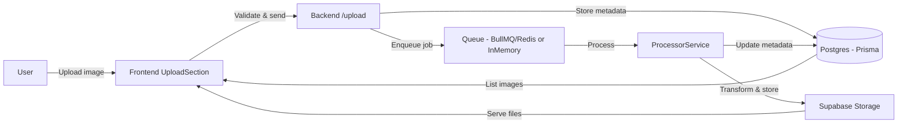
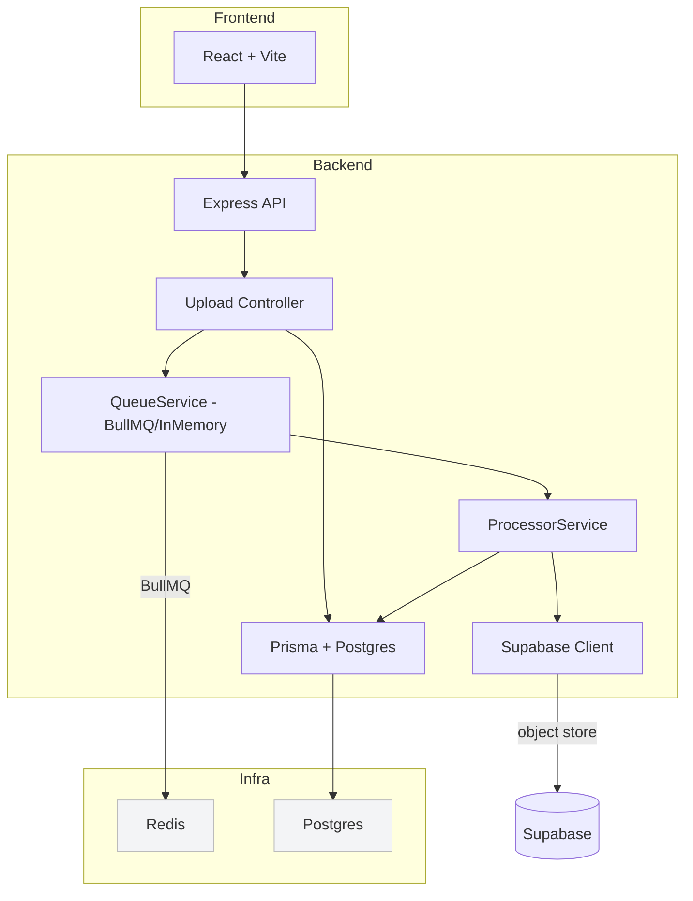

# aragonai-assignment

Brief demo project for image upload, processing and storage — React frontend and Express + BullMQ/Prisma backend.

**Features**
- **Frontend:**
  - Rich image upload UI with drag-and-drop and multi-file support.
  - Client-side validation for file type, size, and basic image dimensions (rejects unsupported types early, including HEIC handling hints).
  - Upload progress and resumable-friendly UI that shows per-file progress and overall batch state.
  - Optimistic UI updates: newly uploaded images appear immediately while backend processing runs; failures are surfaced with retry actions.
  - Responsive, accessible image grid with lazy loading and a lightbox preview for viewing full-size images and metadata.
  - Reusable hooks (`useUploadImages`, `useImages`, `useDeleteImage`) centralize API interactions, caching and state transitions for tests and reuse.

- **Backend:**
  - HTTP API endpoints for uploading, listing, and deleting images. Uses `multer` for safe multipart handling and stream-based ingestion.
  - File validation and conversion pipeline (supports HEIC conversion, image resizing, and format normalization using `sharp` and `heic-convert`).
  - Background processing using `BullMQ` with Redis for production-grade queuing; includes an in-memory fallback to run without Redis in local/dev environments.
  - Stores binary image files in Supabase (object storage), while image metadata (owner, variants, processing status, timestamps) is persisted in Postgres via Prisma.
  - Robust job retry/backoff and a recovery service that can re-enqueue or mark failed work for operator inspection.

These feature descriptions aim to make it easier for contributors and evaluators to understand the functional surface and engineering trade-offs.

**Architecture & approach**
- **Frontend (Vite + React):**
  - Component-driven architecture keeps UI responsibilities scoped: `UploadSection` handles user input and validation; `ProgressList` shows per-file progress and errors; `ImageGrid` renders thumbnails and interactive sorting/filtering; `Lightbox` provides an accessible full-size viewer.
  - Uses `react-hook-form` to simplify complex form state, validation, and accessibility. Custom hooks encapsulate networking logic and keep components focused on rendering.

- **Backend (Express + TypeScript):**
  - The server exposes REST endpoints and delegates CPU- or I/O-intensive image transforms to background workers to keep request latency low.
  - Database access uses `Prisma` with a `PrismaPg` pooled adapter; pooling avoids connection exhaustion and improves throughput under concurrent uploads.
  - Queue layer (`QueueService`) attempts to connect to Redis for BullMQ; if Redis is unavailable the app falls back to a controlled in-memory queue which respects the same concurrency limits and backoff policies.
  - `ProcessorService` performs deterministic image processing steps (resize to multiple variants, convert to web-friendly formats, generate thumbnails) and writes objects to Supabase. It updates metadata and job status in Postgres so the frontend can show accurate state.

Design goals and tradeoffs:
- Keep the HTTP path fast and stateless — accept uploads and enqueue work instead of performing heavy transforms inline.
- Favor clear, inspectable metadata in Postgres rather than opaque blobs — makes recovery and auditing easier.
- Provide safe local development experience — in-memory fallbacks and clear env var guards avoid crashing when optional services are missing.

**Tech stack**
- Frontend: React (component model), Vite (fast hot reload), TypeScript (type safety), optional Tailwind for utility-first styling, `react-hook-form` for forms, Vitest for unit tests.
- Backend: Node.js + Express with TypeScript for routed APIs; `multer` for streaming uploads; `sharp` and `heic-convert` for image transforms; `Prisma`/Postgres for persistent metadata; `BullMQ` + Redis for background jobs; Supabase client for object storage integration.
- Infrastructure & tooling: Docker Compose to run Postgres + Redis locally during development; environment-driven configuration via `.env` files; `ts-node-dev` for hot-reload in development; `prisma migrate` for DB migrations.

Why these choices?
- Vite + React provides a fast developer feedback loop for UI changes.
- BullMQ + Redis offers robust job visibility and retries for production workloads; in-memory fallback keeps developer experience smooth.
- Prisma gives a clear, typed DB client and schema-first migrations that simplify schema evolution.

**Run locally (recommended: Docker Compose)**
Start backend, frontend and dependencies with Docker Compose (recommended):

```bash
docker-compose up --build
```

This brings up the backend, frontend and any configured services defined in `docker-compose.yml`.

Defaults and common ports:
- Frontend: `http://localhost:5173` (Vite default)
- Backend API: `http://localhost:4000` (check `backend/src/server.ts`)
- Postgres: `5432` (in-container)
- Redis: `6379` (in-container)

**Run locally (without Docker)**

Backend
```bash
cd backend
npm install
# supply required env variables (DATABASE_URL, REDIS_URL optional, SUPABASE_URL, SUPABASE_SERVICE_ROLE_KEY, SUPABASE_BUCKET)
npm run dev
```

If you run without Docker you should also run the database and optionally Redis locally. Use Prisma to run migrations before starting the server:

```bash
cd backend
npx prisma migrate deploy
```

Frontend
```bash
cd frontend/aragonai
npm install
npm run dev
```

Notes
- The backend will fall back to an in-memory queue if `REDIS_URL` is not provided — this is intentional to keep the dev loop friction low, but it means jobs won't survive a process restart.
- `DATABASE_URL` must be provided for Prisma; without a reachable Postgres instance the server will throw at startup.
- Supabase storage integration is optional for local testing; if keys are omitted the system can be configured to use a local filesystem fallback (not present by default) or you can point to a test Supabase project.

Troubleshooting tips
- If uploads fail with `ECONNREFUSED` for Redis or Postgres, check `docker-compose` is running or your local services are listening on the correct ports.
- Enable backend logs by setting `NODE_ENV=development` to see Prisma query logs and queue activity.
- To reprocess failed jobs manually, use the recovery utility in `backend/src/services/recoveryService.ts`.

Where to look
- Frontend sources: [frontend/aragonai](frontend/aragonai)
- Backend sources: [backend](backend)


**Diagrams**

Feature flow



Architecture overview

